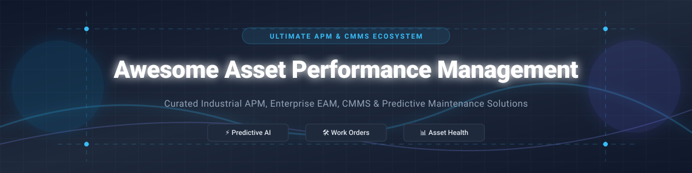

  

# 🛠️ Awesome Asset Performance Management (APM) & CMMS Ecosystem ⚙️

> **A curated list of top Industrial Asset Performance Management (APM) SaaS suites, Enterprise Asset Management (EAM), open-source Computerized Maintenance Management Systems (CMMS), and predictive maintenance machine learning libraries.** 🚀

---

## 💡 Industry Overview & Market Intelligence

> 📈 **Estimated Global APM & EAM Market Size**: **~$28.5 Billion (2026)**, projected to reach over **$45 Billion by 2030** (CAGR ~11.8%).  
> 🧩 **Market Fragmentation**: The market is **moderately fragmented to concentrated** at the top tier. Enterprise heavyweight suits (GE Vernova, SAP, IBM Maximo, AVEVA) dominate industrial mission-critical setups, while mid-market cloud CMMS providers (MaintainX, Fiix, UpKeep) compete dynamically for factory-floor and facility workflows.

---

## 📑 Table of Contents
- [🏢 SaaS & Commercial Enterprise Platforms](#-saas--commercial-enterprise-platforms)
- [🔓 Open-Source GitHub Projects & Frameworks](#-open-source-github-projects--frameworks)
- [🤝 How to Contribute](#-how-to-contribute)
- [💖 Support & Sponsorship](#-support--sponsorship)
- [📈 Star History](#-star-history)
- [⚠️ Disclaimer](#%EF%B8%8F-disclaimer)

---

## 🏢 SaaS & Commercial Enterprise Platforms

Below is a comparative breakdown of top commercial APM and CMMS platforms, sorted by **Company Size / Valuation (Descending)**.

| Platform 🚀 | Company Size & Valuation 🏢 | Entry Pricing 💰 | Free Tier / Trial Limit 🎁 | Key Strengths & Focus Areas 🎯 |
| :--- | :--- | :--- | :--- | :--- |
| **[GE Digital APM / GE Vernova](https://www.gevernova.com/)** | **~$254B Market Cap** ($45.5B Revenue) | Custom Enterprise Quote (AppPoints / Module Tier) | 14-Day Request-Based Demo | Industrial reliability engineering, digital twins, vibration analysis & predictive analytics for heavy equipment. |
| **[SAP APM & EAM](https://www.sap.com/products/scm/asset-performance-management.html)** | **~$245B Market Cap** (€36.8B Revenue) | ~$100+/user/month (Tiered Enterprise Core) | 30-Day Guided Enterprise Trial | Seamless integration with SAP S/4HANA ERP, asset strategy, risk-based maintenance & IoT sensor pipelines. |
| **[IBM Maximo Application Suite](https://www.ibm.com/products/maximo)** | **~$218B Market Cap** ($67.5B Revenue) | ~$160–$300/user/month (AppPoints Model) | 14-Day MAS Hands-On Sandbox | Industry gold standard for global EAM, AI-powered work orders, predictive maintenance & visual inspection. |
| **[Senseye APM](https://www.senseye.io/)** *(Siemens)* | **~$140B Parent Market Cap** (Siemens DI Subsidiary) | Custom Enterprise Quote (Per-Asset Tier) | 30-Day Guided Proof-of-Concept Trial | Machine learning failure forecasting, automated remaining useful life (RUL) estimation & condition monitoring. |
| **[MaintainX](https://www.getmaintainx.com/)** *(Autodesk)* | **$3.6B Valuation** ($135M+ ARR) | $21 per user/month | **Free Forever Basic Plan** (Unlimited Work Orders & Asset Registries) | Mobile-first frontline CMMS, procedure checklists, parts inventory & real-time team messaging. |
| **[Fiix CMMS](https://www.fiixsoftware.com/)** *(Rockwell Automation)* | **~$30B Parent Market Cap** (~$23.5M Business Unit) | $45 per user/month | **Free Forever Plan** (Up to 3 Users & 25 Active PM Tasks) | Cloud CMMS with AI insights (Fiix Foresight), work order automation & native PLC/SCADA integration. |
| **[eMaint CMMS](https://www.emaint.com/)** *(Fluke / Fortive)* | **~$26B Parent Market Cap** (Fortive Subsidiary) | $69 per user/month | 14-Day Guided Sandbox Trial | Deep integration with Fluke wireless vibration & thermal sensors, compliance tracking & multisite EAM. |
| **[UpKeep](https://www.onupkeep.com/)** | **~$50M Total Raised** (~$22.4M Annual Revenue) | $20 per user/month | 14-Day Full-Featured Free Trial | Modern maintenance management, mobile work orders, IoT sensor monitoring & barcode scanning. |

---

## 🔓 Open-Source GitHub Projects & Frameworks

Top open-source CMMS, asset tracking tools, and predictive analytics libraries, sorted by **GitHub Stars (Descending)**.

| Project Name 📦 | GitHub Star Count 🌟 | Primary Category 🏷️ | Core Description & Capabilities ⚡ |
| :--- | :--- | :--- | :--- |
| **[Odoo Maintenance Module](https://github.com/odoo/odoo)** |  | Enterprise ERP & Maintenance | Open-source ERP featuring integrated maintenance requests, mean time between failures (MTBF/MTTR), and equipment tracking. |
| **[ERPNext Maintenance](https://github.com/frappe/erpnext)** |  | Enterprise ERP & Maintenance | Full-fledged open-source ERP with dedicated asset management, maintenance schedules, work orders, and depreciation logs. |
| **[Snipe-IT](https://github.com/snipe/snipe-it)** |  | IT Asset Management (ITAM) | Premier open-source IT asset management system for tracking hardware assets, software licenses, accessories, and maintenance audits. |
| **[InvenTree](https://github.com/inventree/InvenTree)** |  | Inventory & Hardware Management | Open-source inventory, part tracking, and equipment maintenance management system designed for industrial production lines. |
| **[GLPI Project](https://github.com/glpi-project/glpi)** |  | Asset & Service Management | Comprehensive open-source ITIL service desk and asset management software for enterprise infrastructure lifecycle management. |
| **[Shelf.nu](https://github.com/Shelf-nu/shelf.nu)** |  | Modern Asset & Equipment Tracking | Asset management platform with QR code generation, equipment check-in/out workflows, and location tracking. |
| **[Ralph](https://github.com/allegro/ralph)** |  | Data Center & Hardware CMDB | Open-source asset management system for data center equipment, hardware inventories, and network device life-cycles. |
| **[Atlas CMMS](https://github.com/Grashjs/cmms)** |  | Industrial CMMS | Self-hosted Docker-based Computerized Maintenance Management System for preventive maintenance, work orders, and asset tracking. |
| **[SuperCMMS](https://github.com/SuperCMMS/Open-Source-CMMS)** |  | Open CMMS Backend | Modular open-source CMMS backend engine for building custom work order scheduling, inventory, and predictive maintenance portals. |

---

## 🤝 How to Contribute

Contributions are highly welcomed! Help us keep this directory updated and comprehensive.

1. 🍴 **Fork** the repository.
2. 📝 **Add/Update** your entry in `README.md` keeping the Markdown tabular formatting consistent.
3. 🔗 Ensure all links point to official documentation or active GitHub repositories.
4. 🚀 Submit a **Pull Request** with a brief summary of the changes.

---

## 💖 Support & Sponsorship

Thank you for visiting this repository! If you find this curated list valuable for your asset performance, reliability engineering, or CMMS projects, please consider supporting the project:

- ⭐️ **Star** this repository to increase its visibility.
- 🍴 **Fork** and contribute new tools or updates.
- 📢 **Share** it with your engineering and maintenance management network.
- ☕ **Sponsor / Buy me a coffee**: Support open-source curation via [GitHub Sponsors](https://github.com/sponsors/ishandutta2007).

---

## 📈 Star History

---

## ⚠️ Disclaimer

- This directory is **community-curated** for educational and research purposes.
- Asset performance and maintenance platforms directly impact critical industrial safety and operational uptime. Always perform independent technical and security reviews before deploying in production environments.

---

  <b>⭐ Star this repository if you find it helpful!</b>

